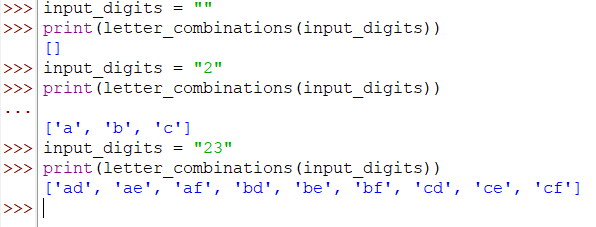
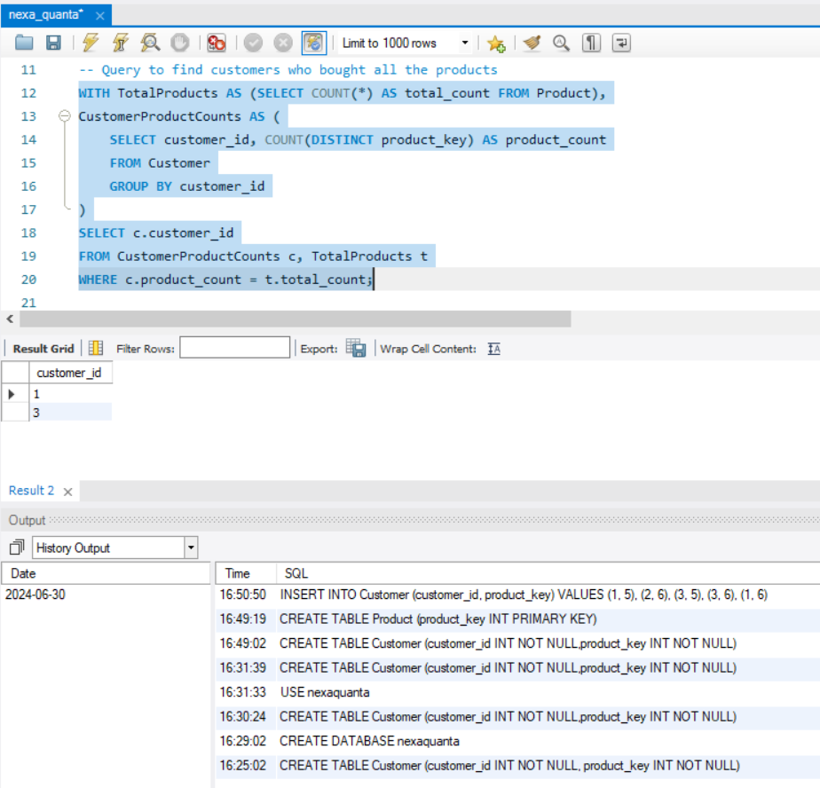
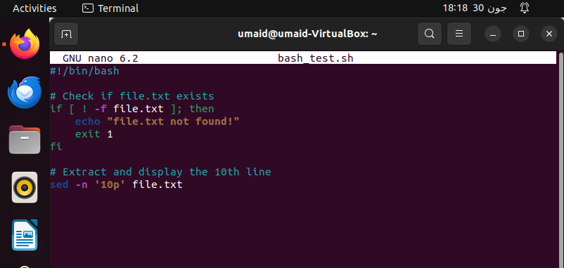
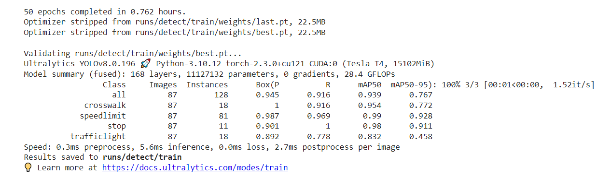
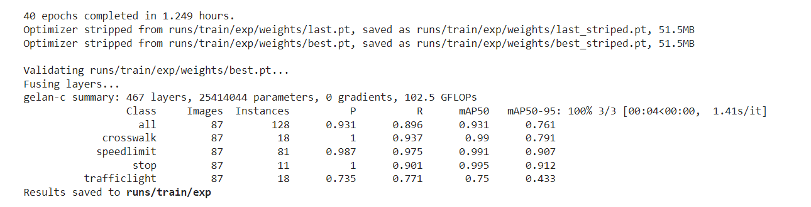
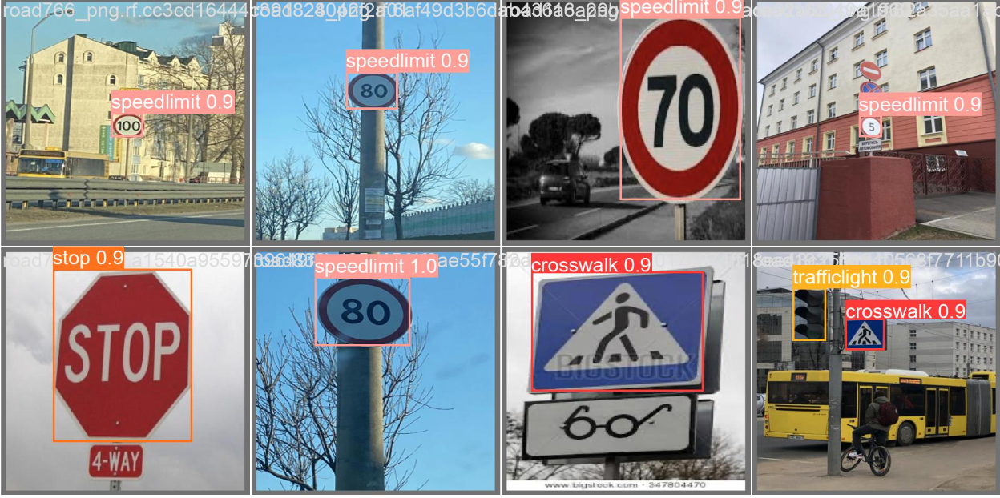

# Senior-CV-Coding-Exams
This repository is the solution of Senior Computer Vision coding exams for an organization. All the questions are separately answered in folders with a detailed Readme section


# Senior Computer Vision Engineer (Coding Skills Evaluation) :speech_balloon:

This repository belongs to the trial project given by Nexa Quanta (Lahore) for the Test Purposes. Syed Umaid has written this code in a way to run it through desired functionality

# Project Title

Objective is to write python codes, SQL codes, bash scripts and training models for the given queries

## Getting Started
Developers have divided the Tasks into five main folders


### Prerequisites

You need to have suitable python version for each of the mentioned queries


```
Version used: Python 3.9.11
```

### Installing

A step by step series of examples that tell you how to get a development-env running

Make the Virtual Environment with Version of Python=3.9. Run the "requirements.txt" file in the Virtual Environment


### The Outputs generated can be visualized in the Provided Screenshot 
### Answer 1

:heavy_check_mark:



### Answer 2
:heavy_check_mark:



### Answer 3

We have tested this bash script by making Virtual Machine on my Laptop.
:heavy_check_mark:



### Answer 4
:heavy_check_mark:

The response is stored in the form of the text file in folder


### Answer 5
:heavy_check_mark:

The notebook contains all visualization, Graphs and Confusion Matrices.
The evaluation metrics are as follows: We have used the annotation files and applied five augmentation techniques on dataset. 
- Rotation
- Brightness
- Shear
- Exposure
- Flipping
- 90 Degree Rotation


Here is the output. We used "YOLOv8 First"




:heavy_check_mark:
We have trained another model on YOLOv9
Here is the output. We used "YOLOv9 with all Evaluation Metrics"





## Built With

* [Ultralytics](https://docs.ultralytics.com/) - To Train the Object Detection Models

## Contributing

Please read [CONTRIBUTING.md](https://gist.github.com/PurpleBooth/b24679402957c63ec426) for details on our code of conduct, and the process for submitting pull requests to us.


## Authors

* **Syed Umaid Ahmed** - *Initial work* - [Researcher](https://github.com/SyedUmaidAhmed)


## License

This project is licensed under the Free License - To Test and Reproduce the Results

